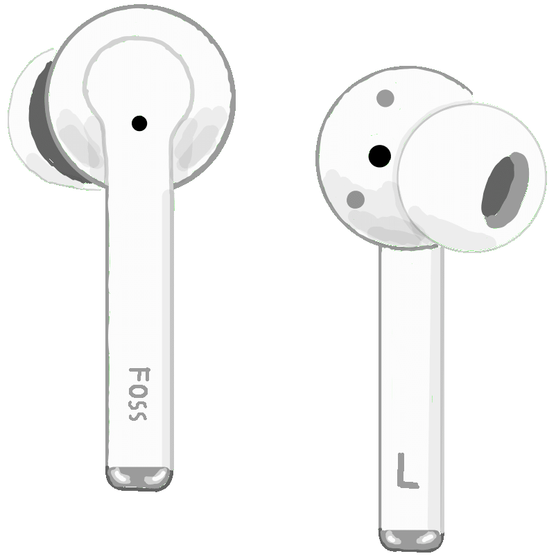

> # TODO: To be reviewed by @mshpp

# 🪪 Device description

| Vendor  | Name  | Release year | Type | Support |
|---|---|---|---|---|
| Huawei | FreeBuds 3i  | 2020 | Fully wireless earbuds | In progress ⌛ |

- Vendor's page: https://consumer.huawei.com/sa-en/support/accessories/freebuds-3i/
- Vendor's app: https://consumer.huawei.com/en/mobileservices/ai-life/

| Vendor's image | Our own 🥰 image |
|---|---|
|   |  |

# 🔎 Discoverability

Current best is to match them by bluetooth name=="HUAWEI FreeBuds 3i"

# 🗣 Protocol description

They speak huawei's serial protocol (probably called "MBB"), through bluetooth classic SPP (serial port profile). Everything about it can be read in: [huawei/PROTOCOL.md](../PROTOCOL.md)

One 'command' (**recevied from**, or **sent to** headphones), typically looks like this:

`5a 00 07 00 2b 04 01 02 01 ff ff ec`

- First and 4th bytes are "magic bytes" - always the same
- 2nd and 3rd is lenght of whole message
- middle is the command, in TLV
- last two is CTC16-Xmodem checksum

(More details are in [huawei/PROTOCOL.md](../PROTOCOL.md))

# 🎛 Features and their access

## - LRC battery (Left, Right, Case)  // TODO: CHECK IF IT'S ALL TRUE

They provide distinct info about % of battery in left and right bud, as well as the charging case

They also indicate whether they are **currently** charging, but this works spotty, especially for the buds

In general, the case itself doesn't seem to have any wireless communication - state of it's charge is updated only when one of the buds is inside it (probably through something like [1-Wire](https://en.wikipedia.org/wiki/1-Wire) through the charging pins). 

So, if you:
1. Pull out both headphones
2. Connect the case to usb
3. => The app will not show that it's charging
4. Put one of the buds inside it
5. => The app will show charging
6. Pull the bud out
7. Disconnect usb
8. => The app will still show 'charging'
9. ...until you put the bud inside again

When it comes to buds 'charging' state, they don't seem to follow any... perdictable pattern... but they show it *very rarely*

Thus, the "charging" state should probably not be used for any serious purposes (like analyzing the battery behaviour/charging speed)

### TODO: Proto

## - ANC (Active Noise Cancellation)

They can actively cancel out the sounds of the environment, as well as pass them through (for talking to people or smth)

Thus you can set ANC in 3 modes:
- noise cancelling
- off
- awareness

> Note that Noise Cancelling (unlike many other modern headphones) doesn't have it's "strength" here - it's either on or off

They can be switched through a long-press on the buds (either of them), or through the app. The long-press can be also customised in which modes it switches (all 3 or selected 2)

### TODO: Proto

## - Auto pause // TODO: CHECK IF IT'S ALL TRUE

> Huawei calls this "wear detection"

They can automatically pause music when you pull out one/both buds out of your ears, and resume it when you put them back

It's pretty smart, because if you started listening with only one bud in, pull it out, then put only one back, it will also resume (not requiring both buds in - just the state that you were listening in)

This (unlike newer models) **cannot** be disabled through app

# 🧑‍💻 Credits

- Documentation: @TheLastGimbus
- Reverse-engineering: @mshpp 
- Code implementation: @mshpp, @TheLastGimbus
- Code maintenance: @TheLastGimbus, @mshpp

(@mshpp => starw1nd_ on Discord)

# 🔗 Other apps and resources

- https://github.com/melianmiko/OpenFreebuds has it in-progress: https://github.com/melianmiko/OpenFreebuds/issues/19